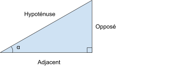
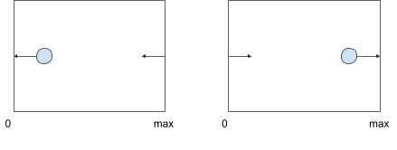
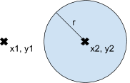

# Exercise 2

## Getting started

First, you must install all the javascript dependencies:

```
npm install
```

You can then execute the tests implemented using [mocha](https://mochajs.org/) and [chai](https://www.chaijs.com/):

```
npm test
```

The output should display a lot of failing tests.
In order for the tests to pass, make modifications to the file `.js`.
The other files in the repository should not be modified.

## Part 1: Trigonometry

You are asked to implement the trigonometric functions that will be used to draw the viewport of the video game.

### random(from, to)

The function `random(from, to)` must return a random integer from the inclusive range `[from, to]`.

Example:

```
var i = random(10, 12) // the possible values are 10, 11 ou 12
```

### randomColor()

The function `randomColor()` must return a short random hexadecimal color.

Example:

```
var color = randomColor() // a possible value is '#AF9'
```

### toRadians(degrees) and toDegrees(radians)

Complete the functions `toRadians(degrees)` and `toDegrees(radians)` that convert degrees to radians and conversly. The Javascript constant [`Math.PI`](https://developer.mozilla.org/en-US/docs/Web/JavaScript/Reference/Global_Objects/Math/PI) should be used to implement them. The relationship between degrees and radians is recalled [here](https://fr.wikipedia.org/wiki/Radian#Relations_entre_grades.2C_degr.C3.A9s_et_radians).

### adjacent(hypotenuse, radians) and opposite(hypotenuse, radians)

Complete the trigonometric functions `adjacent(hypotenuse, radians)` and `opposite(hypotenuse, radians)` that are necessary to compute the position of game objects (kart, rocket) on a 2D plan.
As suggested by the names `adjacent(hypotenuse, radians)` returns the adjacent and `opposite(hypotenuse, radians)` returns the opposite.

Some basic notion of trigonometry are recalled hereafter:

```
Sine = Opposite / Hypotenuse
```

```
Cosine = Adjacent / Hypotenuse
```



The Javascript functions [`Math.sin(x)`](https://developer.mozilla.org/en-US/docs/Web/JavaScript/Reference/Global_Objects/Math/sin) and [`Math.cos(x)`](https://developer.mozilla.org/en-US/docs/Web/JavaScript/Reference/Global_Objects/Math/cos) should be used to implement these functions.

### position(coord, max)

A viewport is a visible area on a plan. When a game objects leaves the viewport at one end, it should reappear at the other end.
Given a viewport on an axis that starts at coordinate 0 and stops at coordinate `max`, complete the function position(coordinates, max) that compute the correct position on the viewport.

Example:

```
position(11, 10) // returns 1
position(-1, 10) // returns 9
```



### collision(pX, pY, cX, cY, cR)

Implement and write the documentation of the function `collision(x1, y1, x2, y2, r)` that returns true if the center of a rocket or spaceship is colliding with an asteroid characterized by a radius.
Recall that the pythagora theorem can be used to verify the distance between a point `x1, y1` and a point `x2, y2` is smaller or equal to a radius `r`



## Part 2: Validation

The `src/validation.js` file contains the description of several validation functions. Each of these functions take a string as a parameter. If a parameter of a different type is passed, an `InvalidArgumentError` is thrown.

The implementation of these function should use a regular expression. If the validation against the regular expression is successful, then the value `true` is returned. Otherwise a `ValidationError` is thrown. The soundness of this choice shall be discussed with your teaching staff after a couple of beers... ;)

You are asked to implement the following validation functions (**TODO Part 1** in `src/validation.js` file). Each function should rely on a Regexp and return a boolean value to indicate if the validation was successful or not.

### name(value)

validate that the submitted value is a valid name:

- Starting with a capital letter;
- Is composed exclusively of letters with the exception of spaces or "-" followed by a capital letter.

examples: Jean, Jean-Jacques, Jean Jacques

### password(value)

validate that the submitted value is a valid password according to the following rules:

- Has a minimum of 8 characters;
- Contains at least one lower case letter, one capital letter, one digit and a special character (#\$^+=!\*()@%&).

examples: abe8\$Cee, rfsB\*8ad

### phone(value)

validate that the submitted value is a valid phone number according to the following rule:

- Should be a string starting by a "+" followed by 11 digits.

examples: +41797778899, +33212223344

### date(value)

validate that the submitted value is a valid date according to the following format:

- yyyy-mm-dd (digits separated by "-").

examples: 2018-02-02, 2000-01-01

### iban(value)

validate that the submitted value is a valid IBAN according to the following rules:

- Starting by two capital letters followed by digits or capital letters;
- Contains a maximum of 34 total characters;
- Not taking any space or "-" between each group of 4 characters in consideration.

examples: CH56 0483 5012 3456 7800 9, CH56-0483-5012-3456-7800-9,GB5604835012345678099
